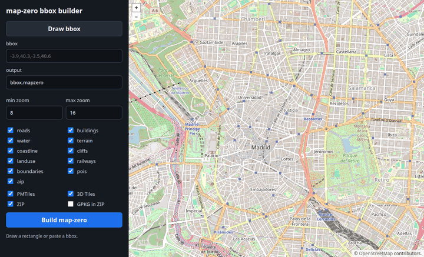
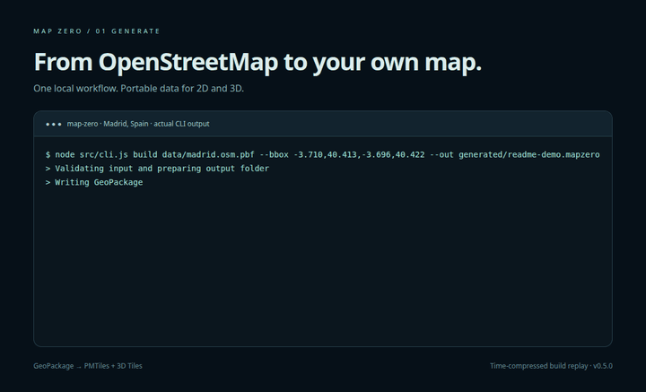
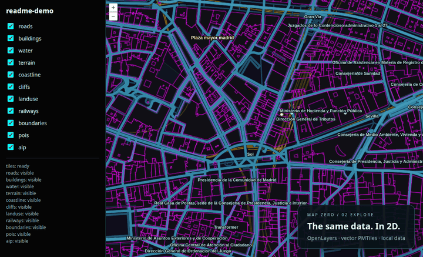
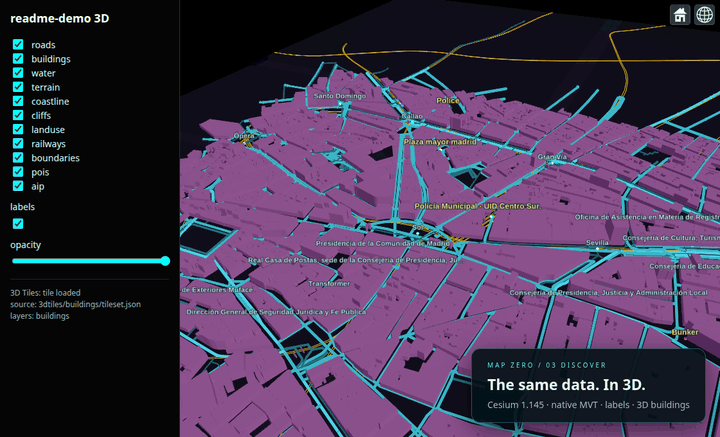
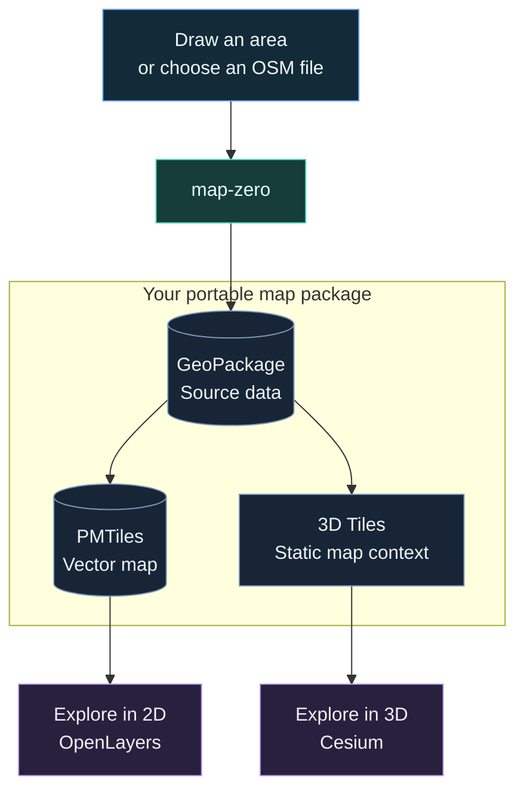

<div align="center">

# map-zero

### Your map. Your data. Anywhere.

**Build portable maps from OpenStreetMap or your own geospatial data.**


[](https://www.npmjs.com/package/map-zero)
[](LICENSE)

[Get started](#quick-start) · [See it in action](#see-it-in-action) · [Documentation](#documentation)

</div>

Create portable vector map packages with **GeoPackage as the persistent spatial source** and **PMTiles for 2D delivery**. Import OpenStreetMap through the CLI, or define your own layers and features through the JavaScript API. Keep data on your machine, share a ZIP, or serve it from your infrastructure.

Use OpenLayers for 2D maps and custom cartography. Cesium consumes prebuilt static 3D Tiles from the same GeoPackage, including map context and spatially streamed labels. Both delivery paths work with static hosting.

[Build from OSM](#quick-start) · [Use your own data](#use-your-own-geospatial-data)

## Quick Start

Use Node.js 22 or newer. Install the CLI and open the map builder:

```bash
npm install --global map-zero
map-zero bbox-ui --output-root ./generated
```

1. Open **http://127.0.0.1:8090**.
2. Click **Draw bbox** and mark your area, or paste its coordinates.
3. Name the output `madrid.mapzero`, choose layers and formats, then click **Build map-zero**.

The builder downloads suitable OpenStreetMap data, reuses cached downloads when available, and shows progress as it creates your package. Start with a small area; larger extracts and higher zoom levels take longer.

When the build finishes, open your map:

```bash
map-zero serve ./generated/madrid.mapzero --port 8080
```

- **2D:** http://127.0.0.1:8080
- **3D:** http://127.0.0.1:8080/cesium

Keep **3D Tiles** enabled when building to include map context, labels and extruded buildings in the 3D view. Generated files stay under the output directory you selected.

## See it in action

### 01 · Draw an area and build

Select your area **directly on a map** with `bbox-ui`: draw a rectangle, adjust its corners, choose layers and outputs, then click **Build map-zero**. The builder finds suitable OpenStreetMap extracts and generates your package locally, including PMTiles, 3D Tiles and a ZIP.



```bash
npx map-zero@0.5.0 bbox-ui --output-root ./generated
```

Open **http://127.0.0.1:8090**. You can also paste coordinates into the bbox field. The animation shows area selection and output configuration; build progress appears in the UI after submitting the job.

<details>
<summary>See the generation pipeline in the terminal</summary>

This animation replays **real CLI output**, with time compressed, from a local OSM extract through GeoPackage, PMTiles and 3D Tiles.



</details>

### 02 · Explore in 2D

Pan, zoom and style vector data in OpenLayers. Use layer controls, zoom and labels to explore your area.



### 03 · Discover in 3D

Explore the same area in 3D, with native vector roads, points, polygons, extruded buildings and labels.



*Real viewer captures using local OpenStreetMap data, © [OpenStreetMap contributors](https://www.openstreetmap.org/copyright). [Recording instructions and static previews](docs/media/README.md).*

## What You Get

One `.mapzero` folder contains your map data, manifest and selected exports. The OSM builder produces this workflow:



| File or folder | What it gives you |
| --- | --- |
| `data.gpkg` | Source features in a standard GeoPackage |
| `tiles.pmtiles` | A single vector tile archive for your map |
| `3dtiles/` | Static geometry and feature metadata for Cesium, including labels |
| `styles/` | Map colors and appearance |
| `manifest.json` | Information connecting the package contents |

PMTiles and 3D Tiles are optional outputs. The optional ZIP contains the map assets; select **GPKG in ZIP** if you also want the source GeoPackage included.

The OSM adapter supplies layers including roads, buildings, water, land use, railways, boundaries, points of interest, terrain outlines, coastlines, cliffs and aviation features. Availability depends on OpenStreetMap coverage in your chosen area.

## Use Your Own Geospatial Data

Install the library in your application:

```bash
npm install map-zero
```

Define your data in your own JavaScript module or source adapter:

1. **Storage schema:** table name, geometry type and `TEXT`/`INTEGER`/`REAL` columns for the GeoPackage writer.
2. **Features:** GeoJSON-shaped geometries in EPSG:4326 and properties matching those columns.
3. **Layer descriptors:** public `id`, physical `table`, optional layer and feature zoom visibility, and properties to include in tiles. Save these in `manifest.json`.

The workflow is **your source → features → data.gpkg → tiles.pmtiles**. No changes to map-zero's OSM layer definitions are needed. Importing a new source format is the responsibility of your adapter; the writer does not parse arbitrary source files.

[Complete runnable example and API reference](docs/custom-data.md) covers writing, querying and exporting a custom dataset. Supply application styles for your own layer IDs; the bundled themes target OSM cartography.

## Other Ways to Build

Already know the coordinates? Build directly from a bounding box:

```bash
map-zero from-bbox --bbox -3.710,40.413,-3.696,40.422 --out ./madrid.mapzero
```

Already have an OSM file? Build locally, then export the 2D and 3D maps:

```bash
map-zero build ./area.osm.pbf --out ./area.mapzero
map-zero pmtiles ./area.mapzero
map-zero 3dtiles ./area.mapzero
```

[More CLI workflows and export options](docs/usage.md).

## Customize and Share

Change the map appearance with a bundled theme:

```bash
map-zero style ./madrid.mapzero --theme neon-dark
```

Share a portable ZIP, including the source data:

```bash
map-zero package ./madrid.mapzero --include-gpkg
```

You can also integrate packages into your own application using **[@map-zero/ol](docs/openlayers.md)** or **[@map-zero/cesium](docs/cesium.md)**. The integration guides cover installation, supported versions, hosting and examples.

## Before You Start

- This is an early alpha; package formats and integration APIs may change between releases.
- The tools create readonly maps. Editing OpenStreetMap data is outside their scope.
- The bbox builder needs internet access for its background map and new source downloads. The bundled viewers currently load their libraries from CDNs; fully offline applications must host those dependencies locally too.
- Large areas require more time, disk space and memory. Building heights depend on available OpenStreetMap attributes, with estimated heights where necessary.

## Documentation

| I want to… | Guide |
| --- | --- |
| Define custom layers and generate GeoPackage/PMTiles | [Custom geospatial data](docs/custom-data.md) |
| Build, export or package maps from the terminal | [CLI workflows](docs/usage.md) |
| Change colors, labels and visible features | [Styles and themes](docs/styles.md) · [Cartography](docs/cartography.md) |
| Add a map to my application | [OpenLayers](docs/openlayers.md) · [Cesium](docs/cesium.md) |
| Read release changes | [Changelog](CHANGELOG.md) |
| Use the local server API | [HTTP API](docs/api.md) |
| Understand performance and technical limits | [Performance review](docs/performance.md) |
| Work on the project | [Development](docs/development.md) · [Architecture](docs/architecture.md) |

## License

[MIT](LICENSE). OSM examples: © [OpenStreetMap contributors](https://www.openstreetmap.org/copyright). Custom datasets retain their own source licenses.
